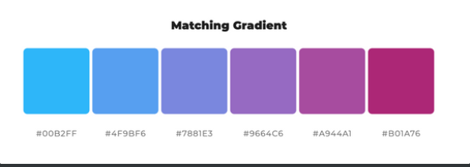
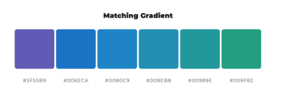
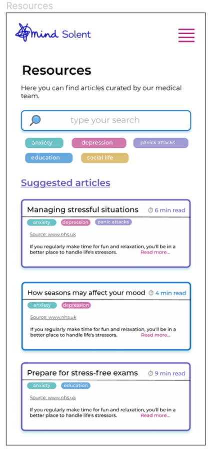
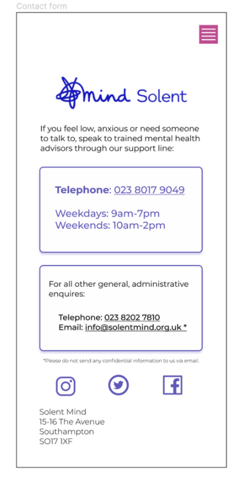

# Solent Mind 🧠 - Project Documentation

## Design Process 🟨 🟧 🟪

- The first week of our schedule is dedicated to design and prototyping an MVP of the product.
- We bring all of our findings together, to wire-frame all main pages of our application, so we can test it with sample users first.
- We are using `Miro` and `Figma` for collaborative brainstorming and design.

### Colour Scheme 🎨




- These are our two main palettes. We have chosen purple/blue colours as our main hues and pink shades as our secondary
- purple: #5F55B9
  blue: #006ECA
  dark pink: #B01A76
  mustard yellow: #FFB703
- The purple is found on all pages, as it is most closely associated with the current colour scheme of the brand. Dark pink is being used for menu and action related elements.

## Consistency ⚖️

- We tried to make as many reusable elements as possible and keep an even design on all pages.
- The main characteristics are: containers with softly rounded corners, bolder borders with soft glow and a rounder font as well.
- The main elements on each page are placed in containers, whereas secondary information is left plain.




## Proposed Stack 🥞

Our assumptions before usability testing were:

- Tailwind CSS
- Radix UI
- Storybook
- Supabase
- Next.js/React

After our design process and usability testing, we have had some new considerations though, which prompted us to think of a different back-end option, `Airtable`. Due to the pricing of the plan, we are not certain how viable it can be for a non-profit organisation.

On the front-end, we agree on the React/Next.js frameworks, and consider some more CSS options. The combination of `Tailwind CSS` with `Headless UI` seems very interesting and we are all keen to explore it.

## Analysis of our proposed stack

### Current considerations & technical decisions

### Were does the data come from? 👤 → 📀

- Product owner → Courses, announcements, capacity and availability info on the website, images, assets, initial user data, account creation
- Individual users → change password, add a booking, un-enrol from a class

### Need to sync data across devices? 🖥 📲

- All data is going to be stored in a database
- Access from any device yields the same results
- React updates any components that change based on states

### Will your app run on the client or server (or both)?

- Almost all data comes from database.
- The exception (for now) is who is logged in at a particular time, which is going to be client-side.

### Do you need database? Could you use local storage instead? 📦

- Due to the nature of the application (courses booking system), we need a robust back-end.

### Relational vs Non-relational

- Relational database - we have different entities to consider with different relations forming amongst them.
- We can avoid duplication by having a different table for the courses, users, resources, etc.
- In each table, we have different fields of id, name, number, etc.

### Do you need full control of the data? Could you use a simple hosted service like Airtable?

- under discussion...

### Can you build “frontend first” to validate the MVP?

- We are going to start from the back-end first, to have a clear schema that we know we will have to work with.

### Do you need help managing styling?

- Tailwind CSS with headless

### Do you need a frontend framework? ⚛

- Yes, we have data that needs to be updated for the user

### Will you use a platform-as-a-service (like `Heroku` or `Vercel`)?

- We will deploy to `Vercel`, the designated platform for `Next.js` projects.

### ⚠️ Considerations about `authentication` 🔐

- due to GDPR concerns, we have to re-think our first assumption to login users with their e-mails
- we want to provide a solution, in which we never receive or store users' email addresses in our database
- magic link option → the product owner provides the users with sign-up, log-in links instead
- third party authorisation → the user signs-up through another provider (Google, Facebook, Github)

# BUILD - WEEK 1 🧱


## `Supabase` 📦

- authentication happens with `supabase` magic link
- after we sign-up a new user, we trigger the creation of the same user to the `users` table

### Rendering the courses somebody is currently enrolled in

- For this, we have a separate table called `enrolments` in our database. It has 2 columns, the `user_id` and `course_id` (the course the user is currently enrolled in).
- As always, the ternary was a bit tricky to write:

```jsx
<p>
  {enrolData && enrolData[0]
    ? enrolData.map((data) => <p key={data.course_id}>{data.classes.name}</p>)
    : 'You are not enrolled in any classes!'}
</p>
```

### Changing font with `Tailwind CSS` & `Next.js`

- `_document.js` in `pages` folder

```jsx
import Document, { Html, Head, Main, NextScript } from 'next/document';

class MyDocument extends Document {
  render() {
    return (
      <Html>
        <Head>
          <link
            href="https://fonts.googleapis.com/css2?family=Montserrat:ital,wght@0,400;0,500;1,400&display=swap"
            rel="stylesheet"
          />
        </Head>
        <body>
          <Main />
          <NextScript />
        </body>
      </Html>
    );
  }
}

export default MyDocument;
```

## Estimation vs Actuals 📐

- Completed tasks → E 13 / A 16

# BUILD - WEEK 2 🧱

- passing the `url` in the `Tabs` component

```jsx
const Tabs = ({ contents, url, children }) => {
  return (
    <ul className=" p-4">
      {contents.map((content) => (
        <Link
          href={content.url ? content.url : `/courses/${content.name}`}
          key={content.topic}
        >
          <a target={content.url ? '_blank' : ''}>
            <li className="border border-BLUE p-2 rounded mb-4 shadow-md">
              <div className="flex flex-row justify-between font-bold items-center">
                <div>
                  {content.topic ? <>{content.topic}</> : <>{children}</>}
                </div>
              </div>
            </li>
          </a>
        </Link>
      ))}
    </ul>
  );
};
```

our `Tabs` component ended up having lots of information that is currently making less reusable. We are considering restructuring our code to move this info in the respective pages (About Us & Courses)

### 👑 Implementing Booking functionality

- we check the courses the user is currently enrolled in:

```jsx
const fetchData = async () => {
  const user = await supabase.auth.user();
  console.log('USER is: ', user);
  const { data } = await supabase
    .from('enrolments')
    .select('course_id')
    .eq('user_id', user.id);
  console.log('data from index:', data);
  setEnrolledCourses(data);
  console.log('enfolledCourses:', enrolledCourses);
};
useEffect(() => {
  fetchData();
}, []);
```

- we take all enrolled courses and flatten their ids into an array:

```jsx
const enrolledArr = enrolledCourses.map(Object.values).flat();
```

- and we pass the `includes()` statement into the `EnrolTag`:

```jsx
<EnrolTag enroll={enrolledArr.includes(course.id)} />
```
