# Solent Mind 🧠 - Project Documentation

## Table of contents 🔖

- [What are we building?](#what-are-we-building) 🧱
- [Research and findings](#research-and-findings) 🔎
- [Design Process](#design-process) 🟨 🟧 🟪
- [Proposed Stack](#proposed-stack) 🥞
- [Development](#development) 🧑‍💻
  - [WEEK 1](#week-1) 🧱
  - [WEEK 2](#week-2) 🧱
- [Estimation vs Actuals](#estimation-vs-actuals) 📈
- [Testing](#testing) 🧪
- [Deployment to `Vercel`](#deployment-to-vercel)
- [Maintenance](#maintenance) 🧰

## What are we building? 🧱

[(Back to top ⬆️)](#table-of-contents)

- Our application offers a platform for the students of [_**Solent Recovery College**_](https://www.solentmind.org.uk/) to sign-up/log-in, view and book courses related to mental health.
- Each user can have a quick overview of the available courses, the ones they have joined and their progress, as well as make a new booking.
- Our goal is to build an easily accessible platform for our target group, to enhance their experience, as well as facilitate the organisers in scheduling and managing the participants.

## Research and Findings 🔎

### User testing 👤 🧪

- We are testing our prototype with a sample group of users.
- Since we strive to make a clear, simple and user-friendly application, we want to understand how a user interacts with a potential version of our app (which is our current mock-up).
- For this, we prepare a questionnaire that will help us navigate our conversations with the users. We aim to understand a little bit about how they interact with technology and any experience they might have with similar apps.
- Our findings will help us go back to our prototype and amend any bits and pieces that may not function the way we have predicted. This way, we have a very clear idea of what we have to build. We can decide how we want to implement certain things and save time by avoiding routes we know they are not going to work.

### User journeys 🎑

#### General questions

- Self introduction
- Could you describe how familiar you are with technology?
- What kind of apps do you like using in general?
- How much time do you usually spend online?
- How do you usually access the internet? Do you prefer desktop or mobile applications?
- How are you currently managing your bookings?

#### Exploring the application / Questionnaire ❓

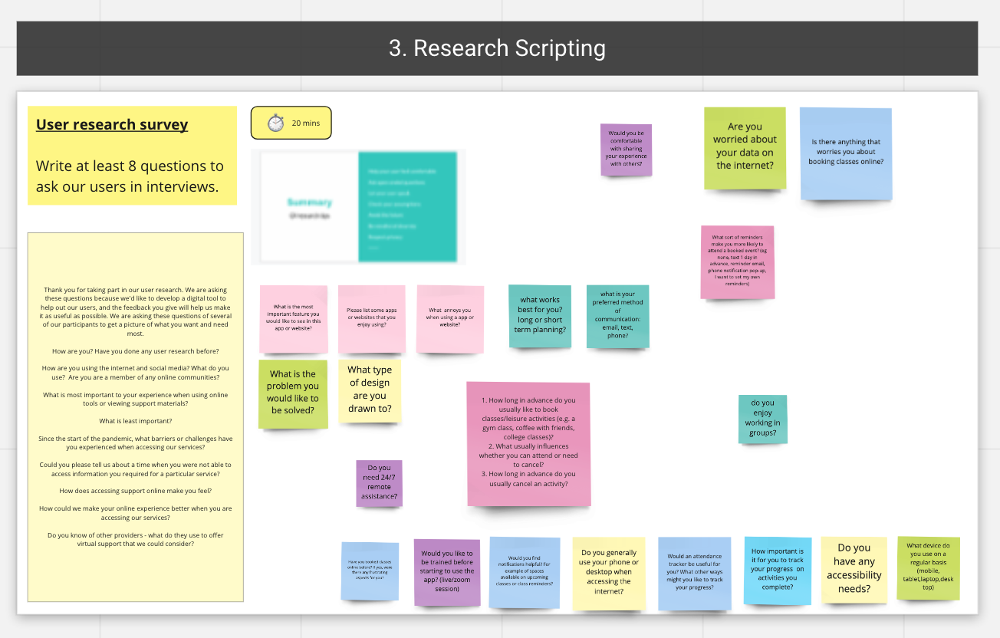

- Sign-in → My Courses → Open Slide Menu → Navigate to different pages
- Can you read everything on the page easily?
- How could you contact the College? Where can you find that information?
- Can you find information about the College?
- How can you find the College's social media links?
- How do you find the menu? Does the order make sense?
- If you have to book a course, what would you do?
  - How would you cancel a booking?
- How can you go to the Resources page?
  - If you want articles of a specific topic, what would you do?
  - If you want to read an article, what would you do?
- What do you expect the link `My Progress` to be about?
  - Is it clear how to use this page?
  - Can you add another goal?
  - Can you tell what you have achieved so far? Where do you find that information?
  - Is there anything else you would like/expect to see here?
  - Do you understand what the `Total` stands for?
- Can you change your profile information? If so, how?
- How using the application compares with your current booking process?
- Provide additional time at the end for any general remarks.

## Design Process 🟨 🟧 🟪

[(Back to top ⬆️)](#table-of-contents)

- The first week of our schedule is dedicated to design and prototyping an MVP of the product.
- We bring all of our findings together, to wire-frame all main pages of our application, so we can test it with sample users first.
- We are using `Miro` and `Figma` for collaborative brainstorming and design.

### Colour Scheme 🎨


- These are our two main palettes. We have chosen purple/blue colours as our main hues and pink shades as our secondary
- purple: #5F55B9
  blue: #006ECA
  dark pink: #B01A76
  mustard yellow: #FFB703
- The purple is found on all pages, as it is most closely associated with the current colour scheme of the brand. Dark pink is being used for menu and action related elements.

### Consistency ⚖️

- We tried to make as many reusable elements as possible and keep an even design on all pages.
- The main characteristics are: containers with softly rounded corners, bolder borders with soft glow and a rounder font as well.
- The main elements on each page are placed in containers, whereas secondary information is left plain.


### Week 2 Update 🪜

Following the feedback of our product owner after the first week build, we changed the colours slightly to fit more the existing `Mind Solent` colour scheme.

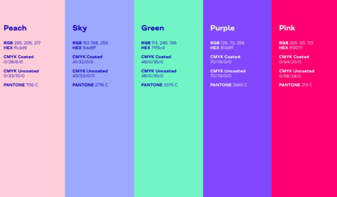

## Proposed Stack 🥞

[(Back to top ⬆️)](#table-of-contents)

Our assumptions before usability testing were:

- Tailwind CSS
- Radix UI
- Storybook
- Supabase
- Next.js/React

After our design process and usability testing, we have had some new considerations though, which prompted us to think of a different back-end option, `Airtable`. Due to the pricing of the plan, we are not certain how viable it can be for a non-profit organisation.

On the front-end, we agree on the React/Next.js frameworks, and consider some more CSS options. The combination of `Tailwind CSS` with `Headless UI` seems very interesting and we are all keen to explore it.

### Analysis of our proposed stack 🥞

#### Current considerations & technical decisions

#### Were does the data come from? 👤 → 📀

- Product owner → Courses, announcements, capacity and availability info on the website, images, assets, initial user data, account creation
- Individual users → change password, add a booking, un-enrol from a class

#### Need to sync data across devices? 🖥 📲

- All data is going to be stored in a database
- Access from any device yields the same results
- React updates any components that change based on states

#### Will your app run on the client or server (or both)?

- Almost all data comes from database.
- The exception (for now) is who is logged in at a particular time, which is going to be client-side.

#### Do you need database? Could you use local storage instead? 📦

- Due to the nature of the application (courses booking system), we need a robust back-end.

#### Relational vs Non-relational

- Relational database - we have different entities to consider with different relations forming amongst them.
- We can avoid duplication by having a different table for the courses, users, resources, etc.
- In each table, we have different fields of id, name, number, etc.

#### Do you need full control of the data? Could you use a simple hosted service like Airtable?

- Yes. We are using database to store information about the available `classes`, as well as information about `enrolments` and `profiles`. Every user is being assigned an id and when they enrol to a course, a new record with their id as well as the course id is being added into the `enrolments` table.

#### Can you build “frontend first” to validate the MVP?

- We are going to start from the back-end first, to have a clear schema that we know we will have to work with.

#### Do you need help managing styling?

- Tailwind CSS with headless

#### Do you need a frontend framework? ⚛

- Yes, we have data that needs to be updated for the user

#### Will you use a platform-as-a-service (like `Heroku` or `Vercel`)?

- We will deploy to `Vercel`, the designated platform for `Next.js` projects.

### ⚠️ Considerations about `authentication` 🔐

- due to GDPR concerns, we have to re-think our first assumption to login users with their e-mails
- we want to provide a solution, in which we never receive or store users' email addresses in our database
- magic link option → the product owner provides the users with sign-up, log-in links instead
- third party authorisation → the user signs-up through another provider (Google, Facebook, Github)

# Development 🧑‍💻

[(Back to top ⬆️)](#table-of-contents)

## WEEK 1 🧱


### Some of the technical problems of WEEK 1 were the following:

## `Supabase` 📦

- authentication happens with `supabase` magic link
- after we sign-up a new user, we trigger the creation of the same user to the `users` table

### Rendering the courses somebody is currently enrolled in

- For this, we have a separate table called `enrolments` in our database. It has 2 columns, the `user_id` and `course_id` (the course the user is currently enrolled in).
- As always, the ternary was a bit tricky to write:

```jsx
<p>
  {enrolData && enrolData[0]
    ? enrolData.map((data) => <p key={data.course_id}>{data.classes.name}</p>)
    : 'You are not enrolled in any classes!'}
</p>
```

### Changing font with `Tailwind CSS` & `Next.js`

- `_document.js` in `pages` folder

```jsx
import Document, { Html, Head, Main, NextScript } from 'next/document';

class MyDocument extends Document {
  render() {
    return (
      <Html>
        <Head>
          <link
            href="https://fonts.googleapis.com/css2?family=Montserrat:ital,wght@0,400;0,500;1,400&display=swap"
            rel="stylesheet"
          />
        </Head>
        <body>
          <Main />
          <NextScript />
        </body>
      </Html>
    );
  }
}

export default MyDocument;
```

### Passing the session from `_app.js`

```jsx
import 'tailwindcss/tailwind.css';
import { supabase, session } from '../utils/supabaseClient';

function MyApp({ Component, pageProps }) {
  const { session, supabase } = useSupabase();
  return <Component session={session} supabase={supabase} {...pageProps} />;
}

export default MyApp;
```

# WEEK 2 🧱

[(Back to top ⬆️)](#table-of-contents)

this was our project board at the end of second week:

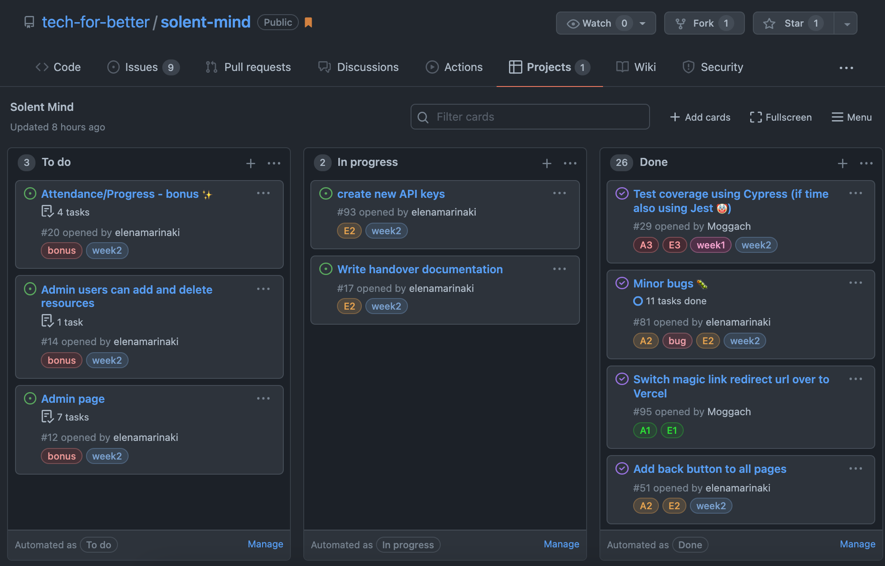

### Some of the technical problems of WEEK 2 were the following:

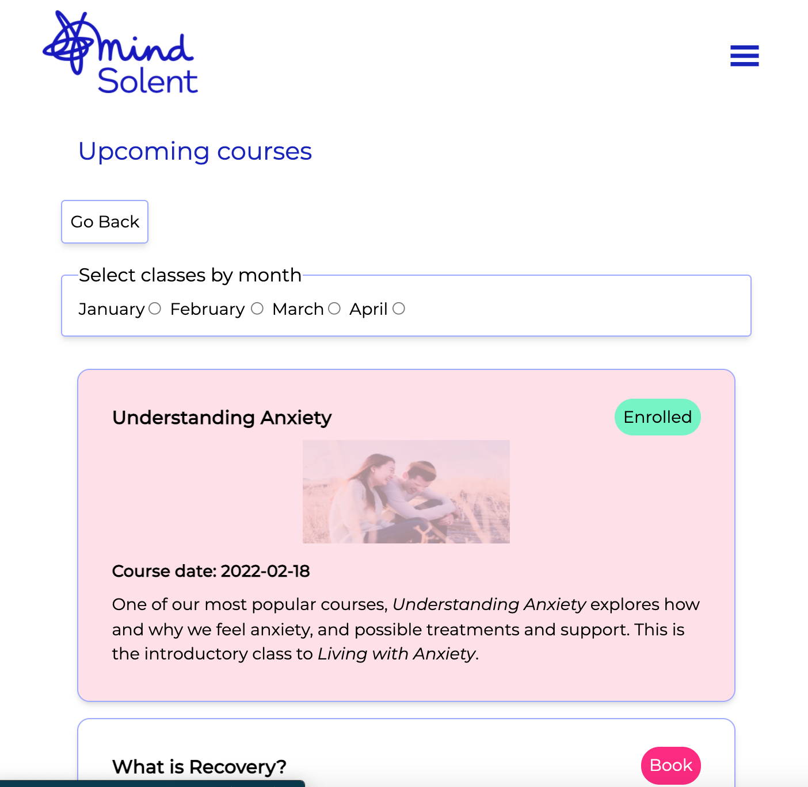

- passing the `url` in the `Tabs` component

```jsx
const Tabs = ({ contents, url, children }) => {
  return (
    <ul className=" p-4">
      {contents.map((content) => (
        <Link
          href={content.url ? content.url : `/courses/${content.name}`}
          key={content.topic}
        >
          <a target={content.url ? '_blank' : ''}>
            <li className="border border-BLUE p-2 rounded mb-4 shadow-md">
              <div className="flex flex-row justify-between font-bold items-center">
                <div>
                  {content.topic ? <>{content.topic}</> : <>{children}</>}
                </div>
              </div>
            </li>
          </a>
        </Link>
      ))}
    </ul>
  );
};
```

our `Tabs` component ended up having lots of information that is currently making less reusable. We are considering restructuring our code to move this info in the respective pages (About Us & Courses)

## Implementing Booking functionality 🎟️

- we check the courses the user is currently enrolled in querying the `enrolments` table:

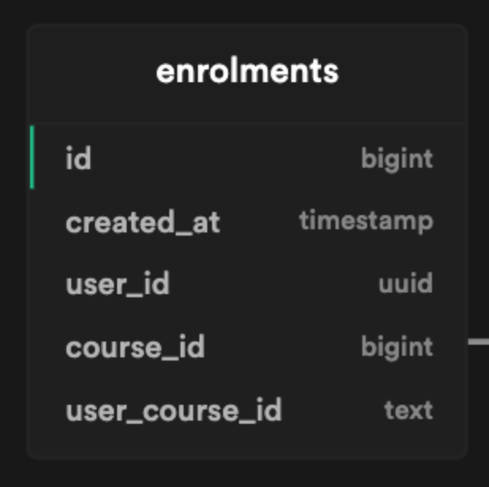

```jsx
const fetchData = async () => {
  const user = await supabase.auth.user();
  console.log('USER is: ', user);
  const { data } = await supabase
    .from('enrolments')
    .select('course_id')
    .eq('user_id', user.id);
  console.log('data from index:', data);
  setEnrolledCourses(data);
  console.log('enfolledCourses:', enrolledCourses);
};
useEffect(() => {
  fetchData();
}, []);
```

- we take all enrolled courses and flatten their ids into an array:

```jsx
const enrolledArr = enrolledCourses.map(Object.values).flat();
```

- and we pass the `includes()` statement into the `EnrolTag`. This way, if the user is booked, the statement will be true and the tag will change to `Enrolled` - if not, the tag shows `Book`:

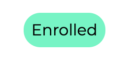
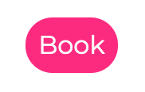

```jsx
<EnrolTag enroll={enrolledArr.includes(course.id)} />
```

- if the user can book into the course, the `enrolments` table is being update, as well as the current capacity of the course

```jsx
const bookCourse = async () => {
  if (
    courseData.length &&
    courseData[0].cur_capacity < courseData[0].max_capacity
  ) {
    const { data, error } = await supabase.from('enrolments').insert([
      {
        user_id: `${userData.id}`,
        course_id: courseData[0].id,
        user_course_id: `${userData.id}${courseData[0].id}`,
      },
    ]);

    const { capacityData, capacityError } = await supabase
      .from('classes')
      .update({ cur_capacity: courseData[0].cur_capacity + 1 })
      .match({ id: courseData[0].id });
    fullClass = false;
  } else {
    fullClass = true;
  }
};
```

## Profile page 👤

The profile page is the user's personal space. They can update their details, as well as upload their own avatar image.

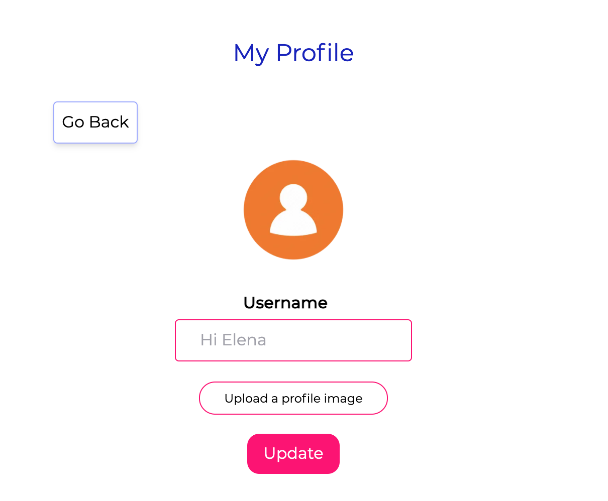
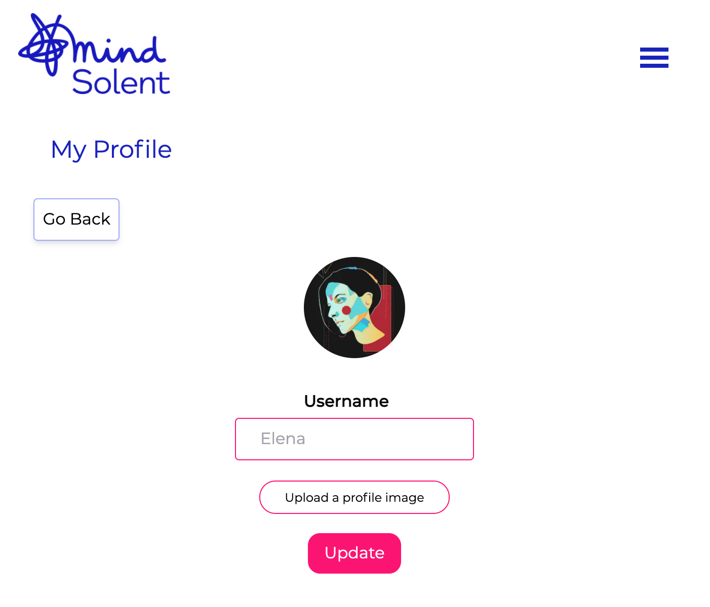

- for the image upload, we are using the `storage` functionality provided by `Supabase`. We store the images in the `avatars` bucket:

```jsx
const { data, error } = await supabase.storage
  .from('avatars')
  .upload(`public/${avatarFile.name}`, avatarFile, {
    cacheControl: '3600',
    upsert: false,
  });
```

- then, we update the field in the `profiles` table:

```jsx
const { imageData, imageError } = await supabase
  .from('profiles')
  .update([
    {
      avatar: `https://bstlldhfipmjeqohhmmo.supabase.in/storage/v1/object/public/avatars/public/${avatarFile.name}`,
    },
  ])
  .match({ id: userData.id });
```

## Creating and implementing modals using `Headless UI` 🎨

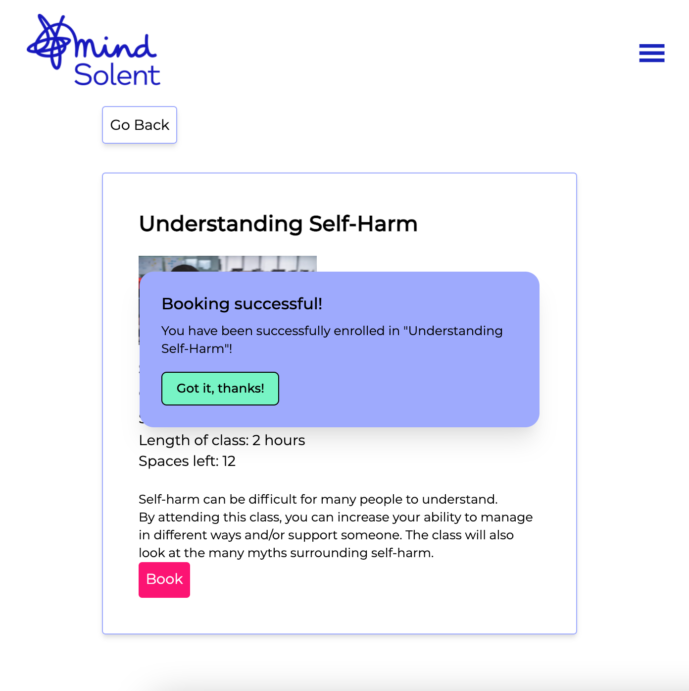
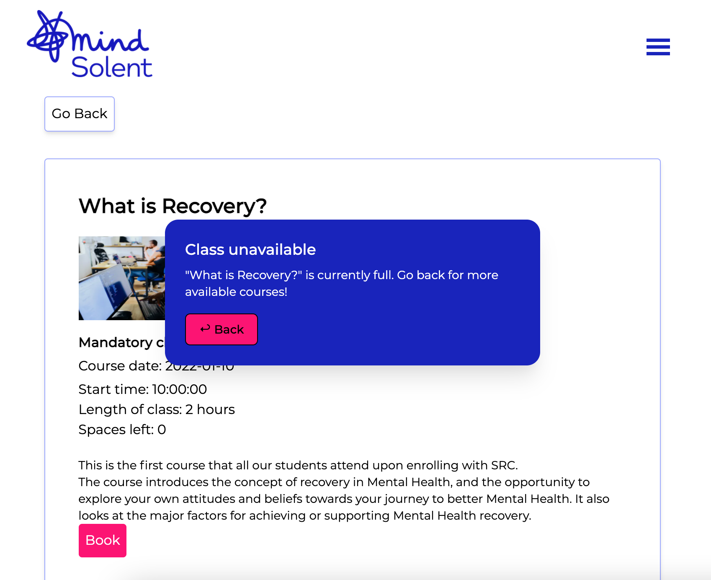

- to use `headless ui`, we first installed the dependency:
  `npm install @headlessui/react`
- we created two separate modal components, one for general _validation_ as well one that serves as an _alert_
- both modals receive as props the **open/close** state from their parent component, in this case `[slug].js`
- in the parent component, `[slug].js` we have 2 different groups of states (for both different types of modals):

```jsx
let [isOpen, setIsOpen] = useState(false);
let [title, setTitle] = useState('');
let [description, setDescription] = useState('');

let [openAlert, setOpenAlert] = useState(false);
let [titleAlert, setTitleAlert] = useState('');
let [descriptionAlert, setDescriptionAlert] = useState('');
```

- inside the modals, we pass the states as `props`:
  `Modal.js`

```jsx
const Modal = ({ openAlert, setOpenAlert, titleAlert, descriptionAlert }) => { ...

```

`ModalAlert.js`

```jsx
const Modal = ({ openAlert, setOpenAlert, titleAlert, descriptionAlert }) => { ...

```

- this way, the opening of a modal is being controlled through the `[slug].js` page, and the closing is being controlled through the modal itself.

### Controlling order in execution 🔄

- we had to be very careful on when we execute any database transaction, since database code is asynchronous - when we click on the `Book` button, things have to happen in the following order:

```jsx
onClick={async () => {
  await bookCourse();
  if (!fullClass) {
    await setTitle('Booking successful!');
    await setDescription(
      `You have been successfully enrolled in "${courseData[0].name}"!`
    );
    await setIsOpen(true);
  } else {
    await setTitleAlert('Class unavailable');
    await setDescriptionAlert(
      `"${courseData[0].name}" is currently full. Go back for more available courses!`
    );
    await setOpenAlert(true);
    // if (!isOpen) {
    //   router.back();
    // }
  }
}}
```

- the database is being contacted first
- if the addition is successful, the first part of the `if` happens:
  - we're passing the `title` and `description` props into our modal
  - we're opening the modal
- if the addition to the database is NOT successful, the second part of the `if` happens:
  - we're passing the `title` and `description` props into our _alert_ modal
  - we're opening the _alert_ modal
  - closing the modal, redirects as back to the previous page (this is happening inside the _alert_ modal)

## Using `next/router` 📍

- we used the `next/router` to implement the `back` button, which is supposed to take us to the previous page
- to use the router:

```jsx
const router = useRouter();
```

- to call the router, we simply do:

```jsx
router.back();
```

## Estimation vs Actuals 📈

[(Back to top ⬆️)](#table-of-contents)

### WEEK 1 📐

- Completed tasks → E 13 / A 16

### WEEK 2 📐

- Completed tasks → E 39 / A 32

## Testing 🧪

[(Back to top ⬆️)](#table-of-contents)

- We used `Cypress` for integration testing and separated the tests into different files based on what's being used
- We have created different user scenarios and simulated user action through writing the tests
- Specific modules are being tested individually (modularization)
  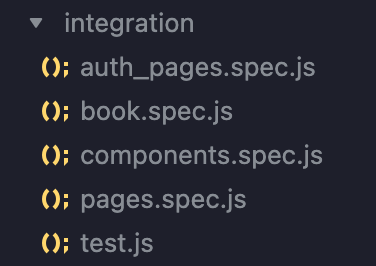
- Authentication not being tested - the tests are written, but they work manually

```js
describe('Shows logged in user stuff', () => {
  it('Displays courses for authenticated users', () => {
    cy.visit('/courses');
    cy.contains('h1').should('be.visible', 'Upcoming courses');
  });
  it('Displays user profile for authenticated users', () => {
    cy.visit('/myProfile');
    cy.contains('h1').should('be.visible', 'My Profile');
  });
  it('Displays user courses for authenticated users', () => {
    cy.visit('/myCourses');
    cy.contains('p').should('be visible', 'Hello,');
    cy.contains('h1').should('be.visible', 'My Courses');
  });
});
```

The tests are verifying obvious bugs, but did not reveal any refined ones.

## Deployment to `Vercel`

[(Back to top ⬆️)](#table-of-contents)

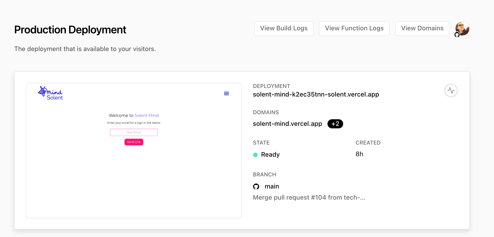

- `Vercel` is a platform for frontend frameworks and static sites, built to integrate with a database and designated deployment platform for `Next.js` projects.
- the **Solent Mind** booking application is currently deployed to `Vercel`.
- the admin page, where you have access to deployment previews, analytics and general project settings is: https://vercel.com/solent/solent-mind

## Maintenance 🧰

[(Back to top ⬆️)](#table-of-contents)

- Our project folder structure is clear and indicative of the architecture of the project.
- All routes are inside the `pages` folders and all components inside a separate `components` folder.
- We are using `Tailwind CSS` for styling, so we have one configuration file `tailwind.config.js`:
  - we apply different pre-made CSS classes inside the js or jsx files to apply styling
- All tests are placed in a separate `cypress` folder.
- In the root folder, we have a `README.md` and `DOCUMENTATION.md` file that provide extensive information on how the application was built, from the design process till the end of the first two-week sprint.

We believe it would be relatively easy for another developer to make changes in the codebase. A new person could quickly be onboarded to contribute to future changes on the project.
