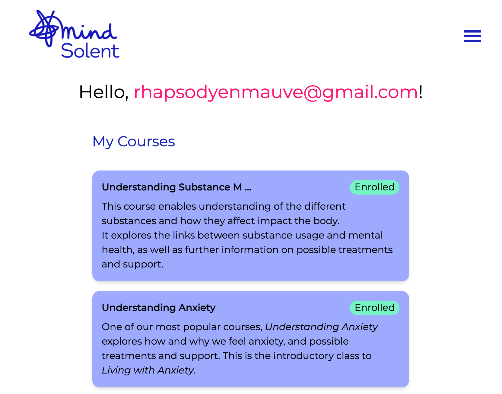
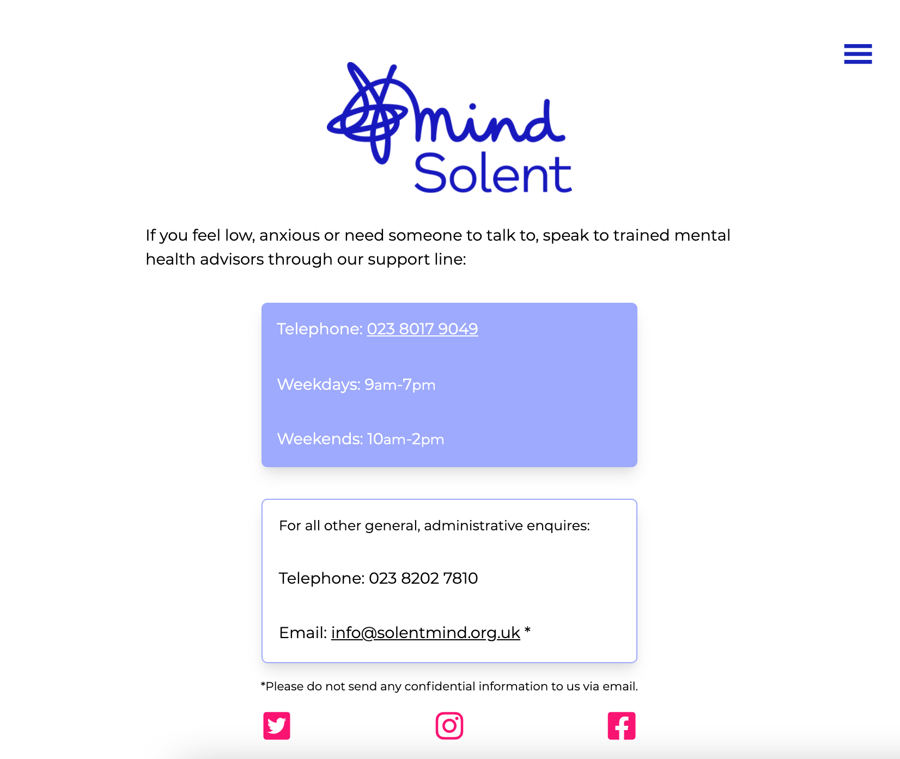
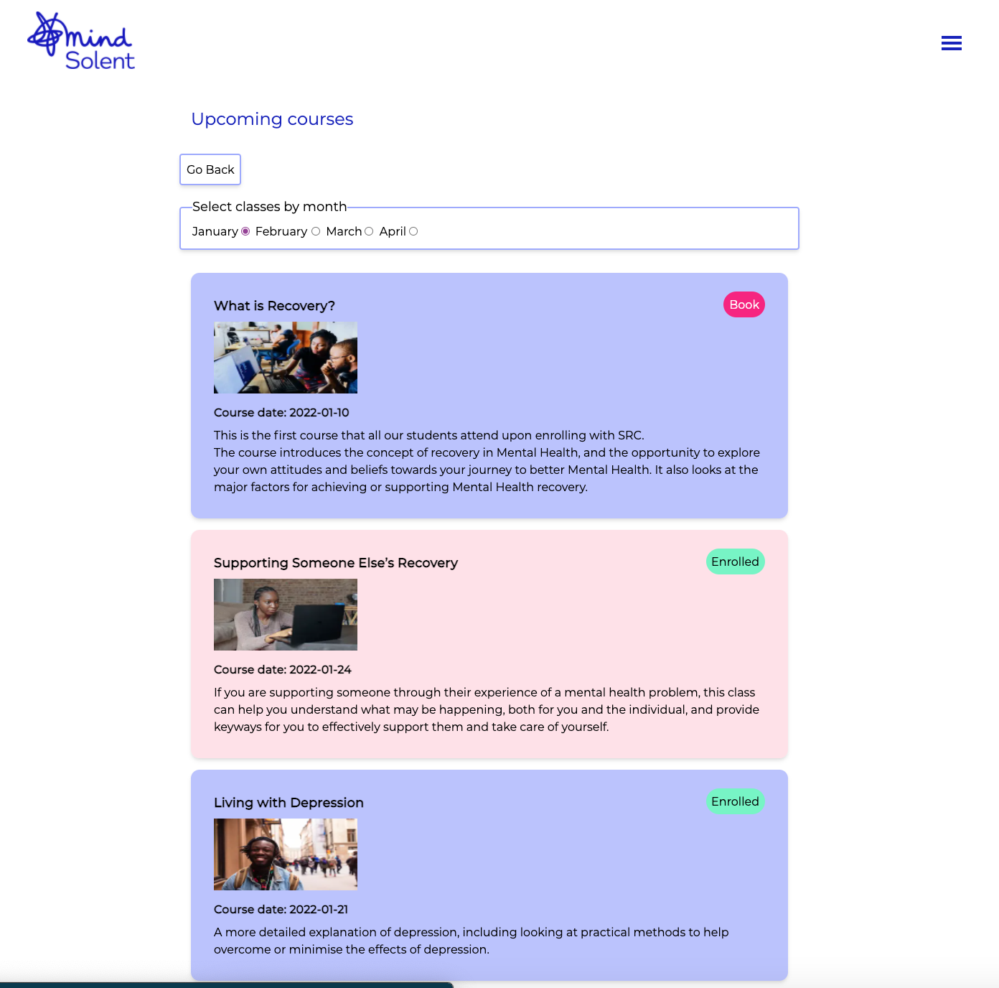
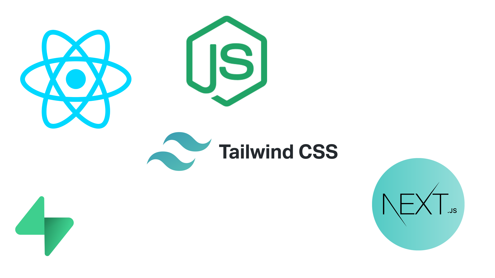
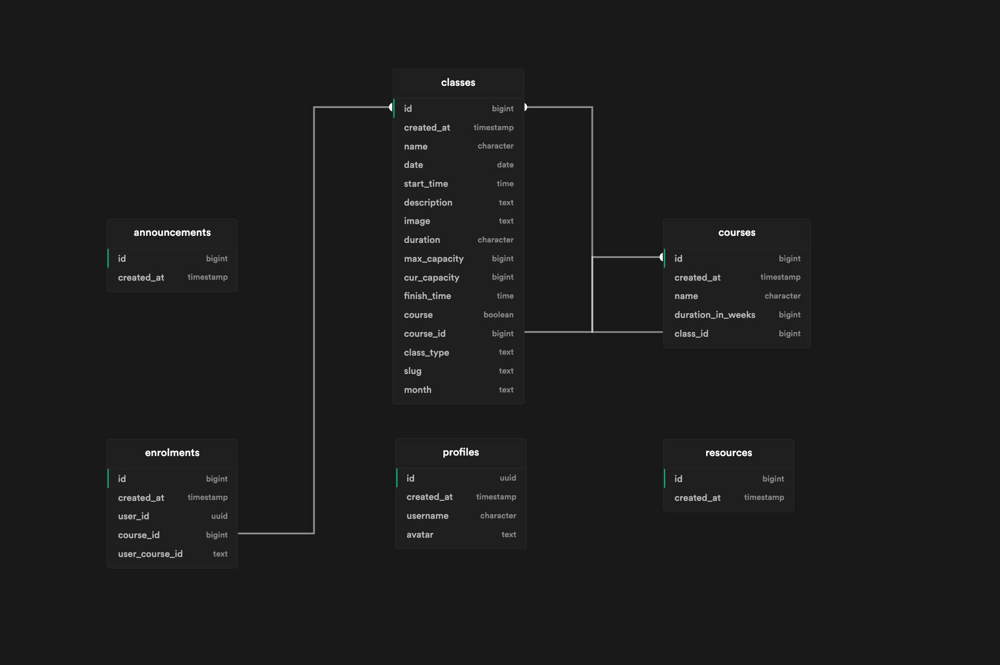

# Solent Mind 🧠

A [Tech For Better project](https://www.foundersandcoders.com/tech-for-better/) by FAC22


(_for detailed project documentation, please look [here](Documentation.md)_ ✨)

## Table of contents 🔖

- [Team](#team) 🪴
- [What are we building?](#what-are-we-building) 🧱
- [Features](#features) ✨
- [Tech Stack](#tech-stack) 🥞
- [Database Schema](#database-schema) 📦
- [Installation](#installation) 👓
- [Key Learnings](#key-learnings) 🧐
- [Additional Features](#additional-features) ⌛
- [Further Information](#further-information) 🔗

## Team 🪴

[(Back to top ⬆️)](#table-of-contents)

- [Anna Cunnane](https://github.com/Moggach)
- [Michael Williams](https://github.com/MJOW1999)
- [Danilo Cupido](https://github.com/danilo-cupido)
- [Jihye Pak](https://github.com/jijip41)
- [Elena Marinaki](https://github.com/elenamarinaki)

## What are we building? 🧱

[(Back to top ⬆️)](#table-of-contents)

- Our application offers a platform for the students of [_**Solent Recovery College**_](https://www.solentmind.org.uk/) to sign-up/log-in, view and book courses related to mental health.
- Each user can have a quick overview of the available courses, the ones they have joined and their progress, as well as make a new booking.
- Our goal is to build an easily accessible platform for our target group, to enhance their experience, as well as facilitate the organisers in scheduling and managing the participants.

## Features ✨

[(Back to top ⬆️)](#table-of-contents)

How can you use the application?

- Sign-up / Log-in with magic link
- Set up a profile
- See available courses the _**Solent Recovery College**_
- Enrol themselves in any course that has availability
- Un-enrol from a course if they cannot attend any more
- See information about the college
- Find contact details about the college






## Tech Stack 🥞

[(Back to top ⬆️)](#table-of-contents)



### Dependencies 🪢

- react
- react-dom
- react-icons
- react-router-dom
- nextjs-redirect
- next
- cypress
- @supabase/supabase-js
- @headlessui/react

## Database Schema 📦

[(Back to top ⬆️)](#table-of-contents)



## Installation 👓

[(Back to top ⬆️)](#table-of-contents)

- Steps to use this project:
  - clone this repo on your device using the command `git clone`
  - `cd` into the `solent-mind` folder
  - run `npm install` to install dependencies locally
  - create an `.env` file in the root folder. It should contain:
  ```
  NEXT_PUBLIC_SUPABASE_URL=your_supabase_url
  NEXT_PUBLIC_SUPABASE_ANON_KEY=your_anon_key
  ```
  - To get your Supabase URL:
    - create an account on https://supabase.io/,
    - create a new project,
    - go to Settings > API > Config > URL
    - the anon key is on the same page, under "Project API keys"
  - run `npm run dev` to start the local server and run the app

## Key Learnings 🧐

[(Back to top ⬆️)](#table-of-contents)

- Collaboration with a product owner
- Organizing architecture for a bigger in scale product and managing tasks within a larger team.
- Code modularization and code reusability
- Learning to use `Supabase` with `Next.js` for the backend.
  - More profound understanding of asynchronous code
  - Using states more efficiently and only when needed
- Learning `Tailwind CSS`
  - understanding how CSS customization works with the use of a framework
  - adapting the framework to our needs
- Debugging code, tracing code paths and refactoring code for optimization purposes

## Additional Features ⌛

[(Back to top ⬆️)](#table-of-contents)

There are a few features we would have liked to implement if we had more time. These include:

- Implement the `Resources` page:
  - this would be a space for teachers to upload material they usually hand out to the students after they have completed a course
  - filtering the material by tag, as well as a search option
- Implement the `Progress` page:
  - here, the user could find all their logged hours
  - budge system: the user is awarded a certificate based on completed hours

## Further Information 🔗

[(Back to top ⬆️)](#table-of-contents)

- https://www.solentmind.org.uk/
- info@solentmind.org.uk
- https://solent-mind.vercel.app/
